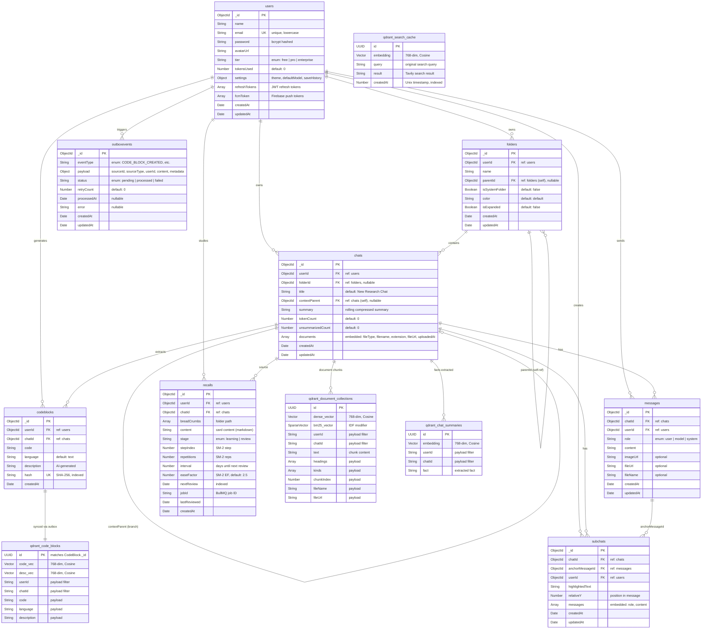

# Dendrites — Entity Relationship Diagram

## Option 1: Mermaid (paste into mermaid.live)



---

## Option 2: DBML (paste into dbdiagram.io)

Paste the code below into [dbdiagram.io](https://dbdiagram.io/d) for an instant interactive ER diagram:

```dbml
// ═══════════════════════════════════════════
// Dendrites — Database Schema (MongoDB + Qdrant)
// Paste this into https://dbdiagram.io/d
// ═══════════════════════════════════════════

// ─── MongoDB Collections ────────────────────

Table users {
  _id ObjectId [pk]
  name String [not null]
  email String [unique, not null, note: 'lowercase, trimmed']
  password String [not null, note: 'bcrypt hashed']
  avatarUrl String [default: '']
  tier String [default: 'free', note: 'enum: free | pro | enterprise']
  tokensUsed Number [default: 0]
  settings_theme String [default: 'dark', note: 'enum: light | dark | system']
  settings_defaultModel String [default: 'gemini-1.5-pro']
  settings_saveHistory Boolean [default: true]
  refreshTokens "String[]" [note: 'JWT refresh tokens']
  fcmToken "String[]" [note: 'Firebase Cloud Messaging tokens']
  createdAt DateTime
  updatedAt DateTime
}

Table folders {
  _id ObjectId [pk]
  userId ObjectId [not null, ref: > users._id]
  name String [not null]
  parentId ObjectId [ref: > folders._id, note: 'self-ref for nesting']
  isSystemFolder Boolean [default: false]
  color String [default: 'default']
  isExpanded Boolean [default: false]
  createdAt DateTime
  updatedAt DateTime

  indexes {
    (userId, parentId)
  }
}

Table chats {
  _id ObjectId [pk]
  userId ObjectId [not null, ref: > users._id]
  folderId ObjectId [ref: > folders._id, note: 'nullable, root if null']
  title String [default: 'New Research Chat']
  contextParent ObjectId [ref: > chats._id, note: 'branch inheritance']
  summary String [note: 'rolling compressed summary']
  tokenCount Number [default: 0]
  unsummarizedCount Number [default: 0]
  createdAt DateTime
  updatedAt DateTime

  indexes {
    (userId, folderId)
  }
}

Table chat_documents {
  _id ObjectId [pk, note: 'embedded subdocument in chats']
  chatId ObjectId [ref: > chats._id]
  fileType String [not null, note: 'enum: image | document']
  filename String [not null]
  extension String [not null]
  fileUrl String [not null, note: 'Cloudinary URL']
  uploadedAt DateTime
}

Table messages {
  _id ObjectId [pk]
  chatId ObjectId [not null, ref: > chats._id]
  userId ObjectId [not null, ref: > users._id]
  role String [not null, note: 'enum: user | model | system']
  content String [not null]
  imageUrl String [note: 'Cloudinary image URL']
  fileUrl String [note: 'attached file URL']
  fileName String
  createdAt DateTime
  updatedAt DateTime
}

Table codeblocks {
  _id ObjectId [pk]
  userId ObjectId [not null, ref: > users._id]
  chatId ObjectId [not null, ref: > chats._id]
  code String [not null]
  language String [default: 'text']
  description String [default: '', note: 'AI-generated via Gemini']
  hash String [unique, not null, note: 'SHA-256 for deduplication']
  createdAt DateTime
}

Table subchats {
  _id ObjectId [pk]
  chatId ObjectId [not null, ref: > chats._id]
  anchorMessageId ObjectId [not null, ref: > messages._id]
  userId ObjectId [not null, ref: > users._id]
  highlightedText String [not null]
  relativeY Number [default: 0, note: 'Y position in message']
  messages "Object[]" [note: 'embedded: {role, content}']
  createdAt DateTime
  updatedAt DateTime
}

Table recalls {
  _id ObjectId [pk]
  userId ObjectId [not null, ref: > users._id]
  chatId ObjectId [not null, ref: > chats._id]
  breadCrumbs "String[]" [note: 'folder path for display']
  content String [not null, note: 'markdown flashcard content']
  stage String [default: 'learning', note: 'enum: learning | review']
  stepIndex Number [default: 0, note: 'SM-2 learning step']
  repetitions Number [default: 0]
  interval Number [default: 0, note: 'days until next review']
  easeFactor Number [default: 2.5, note: 'SM-2 ease factor']
  nextReview DateTime [not null, note: 'indexed for due queries']
  jobId String [note: 'BullMQ delayed job ID']
  lastReviewed DateTime
  createdAt DateTime
}

Table outboxevents {
  _id ObjectId [pk]
  eventType String [not null, note: 'CODE_BLOCK_CREATED | CODE_BLOCK_DELETED | PDF_CHUNK_CREATED | PDF_CHUNK_DELETED | CHAT_SUMMARY_CREATED | CHAT_SUMMARY_UPDATED | CHAT_STATE_UPDATED']
  payload_sourceId ObjectId [not null]
  payload_sourceType String [not null, note: 'code_block | pdf_chunk | chat_summary | chat_state']
  payload_userId ObjectId [ref: > users._id]
  payload_content Mixed [note: 'event-specific data']
  payload_metadata Mixed [note: 'additional context']
  status String [default: 'pending', note: 'enum: pending | processed | failed']
  retryCount Number [default: 0]
  processedAt DateTime
  error String
  createdAt DateTime
  updatedAt DateTime

  indexes {
    (status, createdAt)
  }
}

// ─── Qdrant Vector Collections ──────────────

Table qdrant_code_blocks [headercolor: #6366f1] {
  id UUID [pk, note: 'matches codeblocks._id']
  code_vector "Float[768]" [note: 'Named vector, Cosine distance']
  description_vector "Float[768]" [note: 'Named vector, Cosine distance']
  payload_userId String
  payload_chatId String
  payload_code String
  payload_language String
  payload_description String
}

Table qdrant_document_collections [headercolor: #6366f1] {
  id UUID [pk]
  dense_vector "Float[768]" [note: 'Named dense vector, Cosine']
  bm25_vector "SparseVector" [note: 'Sparse BM25 with IDF modifier']
  payload_userId String
  payload_chatId String
  payload_text String [note: 'chunk content']
  payload_headings "String[]"
  payload_kinds "String[]" [note: 'heading | paragraph | code | table']
  payload_chunkIndex Number
  payload_fileName String
  payload_fileUrl String
}

Table qdrant_chat_summaries [headercolor: #6366f1] {
  id UUID [pk]
  embedding "Float[768]" [note: 'Single unnamed vector, Cosine']
  payload_userId String
  payload_chatId String
  payload_fact String [note: 'extracted fact from summary']
}

Table qdrant_search_cache [headercolor: #6366f1] {
  id UUID [pk]
  embedding "Float[768]" [note: 'Single unnamed vector, Cosine']
  payload_query String
  payload_result String [note: 'Tavily search result']
  payload_createdAt Integer [note: 'Unix timestamp, indexed for TTL sweep']
}

// ─── Cross-store relationships ──────────────

Ref: codeblocks._id - qdrant_code_blocks.id [note: 'synced via OutboxEvent']
Ref: chats._id < qdrant_chat_summaries.payload_chatId [note: 'facts extracted from rolling summary']
Ref: chats._id < qdrant_document_collections.payload_chatId [note: 'uploaded document chunks']
```

---

## How to use each option

| Tool | Steps |
|---|---|
| **Mermaid** | Copy the mermaid block → paste into [mermaid.live](https://mermaid.live) → export PNG/SVG |
| **dbdiagram.io** | Copy the DBML block → paste into [dbdiagram.io/d](https://dbdiagram.io/d) → instant interactive diagram |
| **Moon Modeler** | Connect to your local MongoDB (`mongodb://localhost:27017/dendrites`) → Reverse Engineer → auto-generates from live data |

---

## Qdrant Collection Summary

| Collection | Vector Type | Dimensions | Distance | Purpose |
|---|---|---|---|---|
| `code_blocks` | **Named** (`code` + `description`) | 768 each | Cosine | Dual-vector code RAG |
| `document_collections` | **Named dense** + **Sparse BM25** | 768 + sparse | Cosine + IDF | Hybrid search for uploaded docs |
| `chat_summaries` | **Unnamed single** | 768 | Cosine | Extracted facts from rolling summaries |
| `search_cache` | **Unnamed single** | 768 | Cosine | Tavily search result dedup cache |
