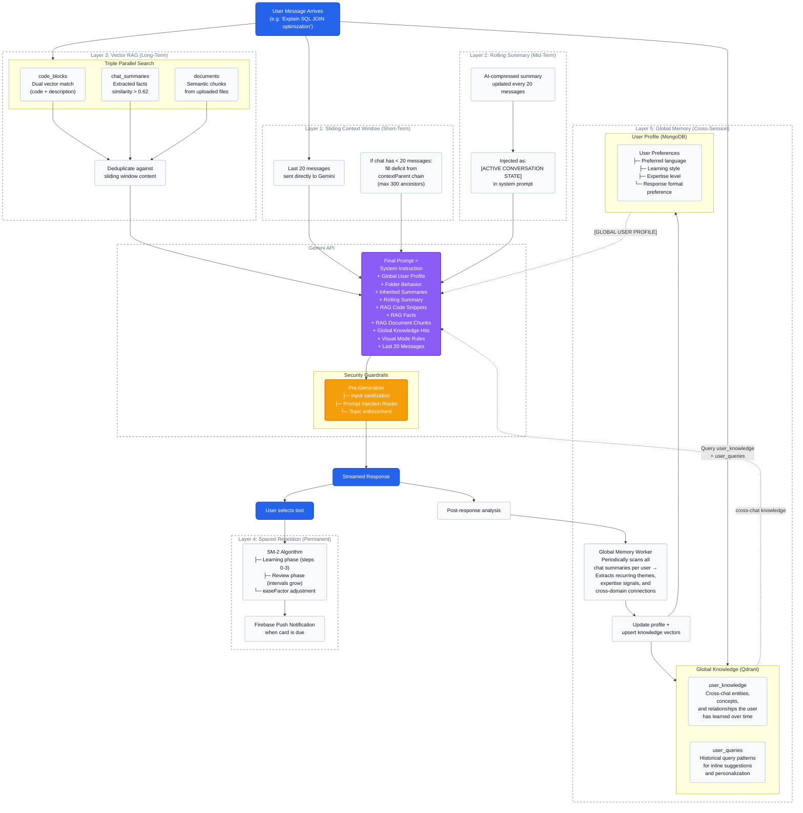

# Nurons (Dendrites) 4+1 Cognitive Memory Architecture

This diagram visualizes how the AI processes user intent through five distinct memory layers, from short-term context windows down to long-term cross-session knowledge and permanent spaced repetition.

