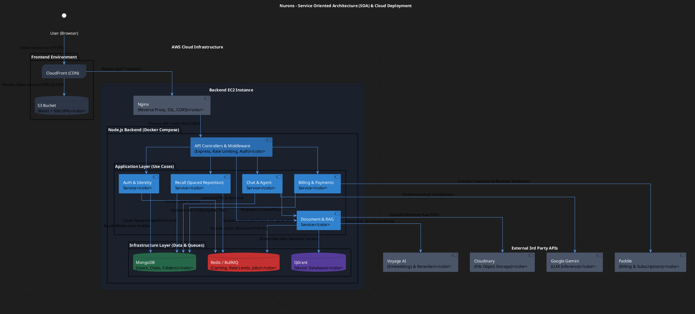

# Nurons System Architecture

Below is the detailed PlantUML diagram mapping out your cloud deployment (AWS S3 + CloudFront + EC2) and your backend's Service-Oriented Architecture (SOA). 

### Explanation of the Architecture:
1.  **The Frontend Edge:** Your users never directly touch your EC2 server for the UI. CloudFront serves your compiled React application from the S3 bucket globally with edge caching.
2.  **Traffic Routing:** API calls from the browser hit CloudFront, which forwards `/api/*` traffic to your EC2 instance. Nginx handles the SSL termination and securely passes the traffic internally to your Dockerized Node.js backend.
3.  **Service-Oriented Architecture (SOA):**
    *   **Presentation (Controllers):** Handles the raw Express endpoints, auth guards, and rate limiting.
    *   **Application (Use Cases):** Your business logic is strictly decoupled into distinct services (Chat, RAG, Recall, Billing).
    *   **Infrastructure (Adapters):** MongoDB holds persistent relational/document state. Redis holds ephemeral state and manages asynchronous processing queues via BullMQ (essential for heavy RAG workloads). Qdrant specifically handles vector mathematics for similarity search.
4.  **External Integrations:** Decoupled adapters communicate with Voyage (for dense embeddings), Gemini (for reasoning), Paddle (for SaaS revenue), and Cloudinary (for blob storage).
