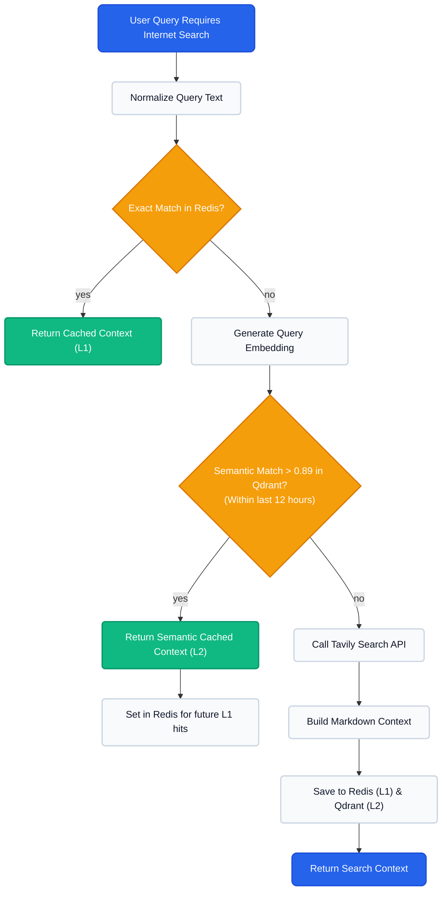

# Semantic Internet Search Caching

Internet search (via APIs like Tavily) can be expensive and slow down the AI response time. Because user queries are often repetitive or rephrased versions of identical questions (e.g., "Who is the CEO of OpenAI?" vs. "OpenAI current CEO"), Nurons implements a **Dual-Layer Caching System** that operates on all general AI chat interactions.

## The Dual-Layer Strategy

This strategy ensures that exact matches are served with zero latency, while semantic matches (meaning similar, but not identical phrasing) are resolved without hitting the external search API.

## Detailed Flow

1. **L1 Cache (Exact String Match - Redis)**: 
   The query is sanitized and normalized. If an exact string match exists in Redis, the RAG context is returned instantly.
2. **L2 Cache (Semantic Vector Match - Qdrant)**: 
   If Redis misses, the query is converted into an embedding vector. Qdrant is queried to find mathematically similar past searches (similarity > `0.89`) made within the last 12 hours. This catches natural language variations.
3. **Execution & Cache Hydration**: 
   If both caches miss, the system performs a live Tavily API search. The markdown result is returned to the LLM and concurrently stored in both Redis and Qdrant to immediately satisfy future variations of the same query.
