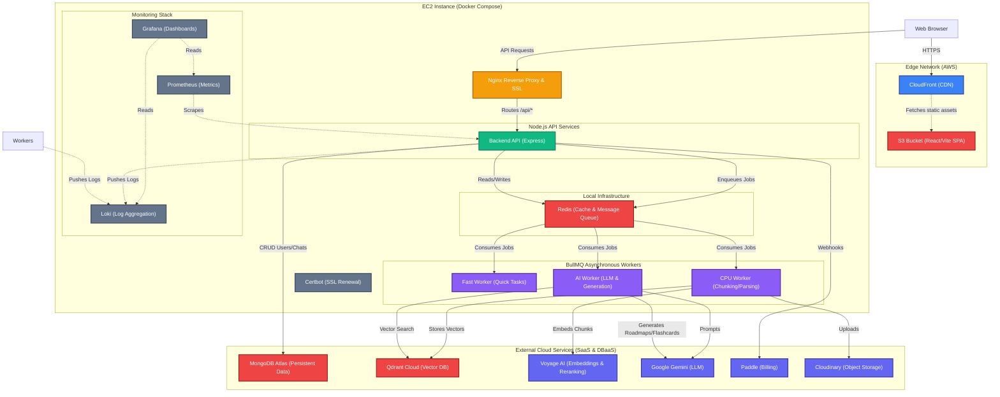

# Nurons (Dentrites) System Architecture

This diagram maps out the full deployment architecture, including the Dockerized microservices, background workers, observability stack, and external cloud services.

# Abstract System Architecture

# Observability stack

